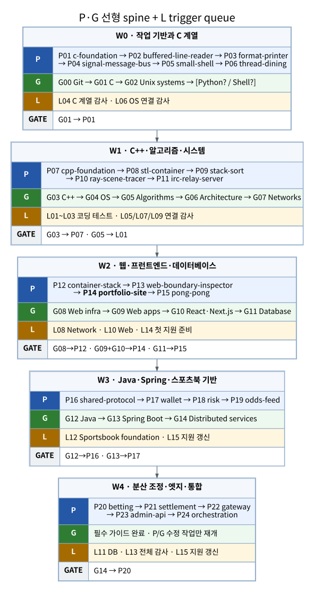

# 선형·병렬 PATH

이 문서는 신규 학습과 보수적인 복습에 사용하는 기본 실행안이다. 42 과정을 이미 수료했고 C·C++·WEB 프로젝트 세 개를 동시에 유지할 수 있다면 [복습용 3트랙 병렬 PATH](11-PARALLEL-PATH.md)를 대체 실행 모드로 사용할 수 있다.

## 실행 그래프

[전체 SVG](../assets/path/master-path.svg) · [전체 PNG](../assets/path/master-path.png) · [Mermaid](../assets/path/master-path.mmd) · [Graphviz DOT](../assets/path/master-path.dot) · [텍스트](../assets/path/master-path.txt) · [L 레인 상세](02-L-LANE.md)



## 실행 규칙

| 레인 | 한 번에 활성화할 블록 | 다음 블록으로 이동하는 조건 |
|---|---:|---|
| `P` 프로젝트 | 1개 | 구현·정상/실패 검증·완료 근거·P0/P1 확인 완료 |
| `G` 가이드 | 1개 | 본문·실습·전체 검증·완료 근거·P0/P1 확인 완료 |
| `L` 한정 작업 큐 | 1회 | 명시된 trigger·범위·산출물을 충족하고 닫음 |

현재 블록을 중단해 같은 레인의 다른 블록으로 이동하지 않는다. 다음 프로젝트가 가이드 하드 게이트에 막히면 `P` 레인을 비우고 현재 `G` 블록을 끝낸다. `L`은 지속 spine이 아니라 trigger 기반 작업 큐이며, 구체적 단위는 [L01~L15](02-L-LANE.md)를 따른다.

## 프로젝트 레인 `P`

| ID | 프로젝트 | 한 줄 역할 | 진입 조건 | 완료 결과 |
|---|---|---|---|---|
| P01 | `c-foundation` | C 정적 라이브러리로 바이트·포인터·소유권·부분 실패를 고정 | G01 완료 | 공개 API, 소유권·rollback, 부분 `write`와 배포 검증을 재현 |
| P02 | `buffered-line-reader` | 호출 사이에 남는 입력 상태와 FD별 수명을 구현 | P01 | `LINE/EOF/AGAIN/ERROR`, remainder와 context 수명 검증 |
| P03 | `format-printer` | 가변 인자와 포맷 문법을 두 순회 출력 계약으로 변환 | P02 | parser·길이·부분 출력·`EINTR/EPIPE` 경계 검증 |
| P04 | `signal-message-bus` | signal handler와 main 문맥을 분리한 IPC 상태 머신 구현 | P03 | self-pipe·session·ACK와 모호한 확정 경계 검증 |
| P05 | `small-shell` | 문법을 프로세스·FD 그래프로 실행 | P04; G02는 C 감사 전 완료 | lexer/parser, pipeline, builtin, redirection, 종료 상태 검증 |
| P06 | `thread-dining` | 공유 주소 공간의 동기화·종료·파괴 수명 구현 | P05; G04는 OS 감사 전 완료 | barrier·잠금 순서·terminal state·join/destroy 검증 |
| P07 | `cpp-foundation` | C++ 객체 수명·값 의미론·다형성·예외 계약을 확립 | P06 + G03 | 깊은 복사, 예외 안전성, factory, template·iterator 검증 |
| P08 | `stl-container` | raw storage 안의 `vector/stack/map`과 반복자 계약 구현 | P07 | allocator·RB-tree·무효화·예외·복잡도·차등 검사 통과 |
| P09 | `stack-sort` | 제한 명령 정렬과 독립 checker/oracle을 분리 | P08; G05는 알고리즘 감사 전 완료 | rank·radix·명령 비용·독립 재생 검증 |
| P10 | `ray-scene-tracer` | 정확성을 보존하는 BVH와 결정적 병렬 렌더링 구현 | P09; G06은 구조 감사 전 완료 | linear/BVH 동치, shading, tile 병렬 checksum 검증 |
| P11 | `irc-relay-server` | 논블로킹 연결 상태를 `epoll/kqueue` 이벤트 루프로 관리 | P10; G07은 네트워크 감사 전 완료 | framing·partial I/O·backpressure·timeout·shutdown 검증 |
| P12 | `container-stack` | 컨테이너 웹 스택의 초기화·영속성·복구를 운영 절차로 구현 | P11 + G08 | TLS, bootstrap, readiness, backup/restore, rotation 검증 |
| P13 | `web-boundary-inspector` | HTTP proxy와 브라우저 runtime의 상태·정책 경계를 관찰 | P12 | request 변환, DOM/Fetch/History/storage/CORS/CSP 검증 |
| P14 | `portfolio-site` | 콘텐츠를 다섯 renderer와 Next.js 배포 gate로 표현 | P13 + G09 + G10 | production build·배포, runtime 검증, 접근성·성능 근거 확보 |
| P15 | `pong-pong` | 브라우저·API·DB·WebSocket을 서버 권위 실시간 서비스로 통합 | P12~P14 + G11 | session·room·scheduler·reconnect·transaction·배포 검증 |
| P16 | `sportsbook-shared-protocol` | Java 값 객체·JSON·Avro 계약의 공통 배포 단위 구성 | P15 + G12 | Maven artifact, 도메인 불변식, schema 호환성 검증 |
| P17 | `sportsbook-wallet-service` | 계좌 snapshot과 복식부기 원장·멱등성을 transaction으로 보호 | P16 + G13 | 잠금·원장·outbox·대사·내부 API 검증 |
| P18 | `sportsbook-risk-service` | Redis Lua 기준 상태로 reservation 수명과 capacity를 원자 전이 | P17 | reserve/commit/release/expiry·replay·AOF 한계 검증 |
| P19 | `sportsbook-odds-feed-service` | provider 입력을 Redis projection·Kafka·Stream 경로로 전달 | P18 | 일반 가격·중요 사건·운영 명령의 서로 다른 보장 검증 |
| P20 | `sportsbook-betting-service` | 위험 예약·지갑 차감·수락을 복구 가능한 PENDING 흐름으로 조정 | P16~P19 + G14 | idempotency·compensation·outbox·recovery 검증 |
| P21 | `sportsbook-settlement-service` | 자체 조회 모델과 wallet plan으로 정산·무효화를 복구 | P20 + P17 | lease·fencing·outbox·DLT·재실행 검증 |
| P22 | `sportsbook-gateway` | 사용자 data plane의 JWT·라우팅·rate limit·STOMP 경계 제공 | P17 + P19~P21 | trusted header, public/internal route, push·readiness 검증 |
| P23 | `sportsbook-admin-api` | 운영 control plane의 권한·위임·감사를 분리 | P22 + 대상 운영 API | RBAC·IP allowlist·audit log·비원자 위임 경계 검증 |
| P24 | `sportsbook-orchestration` | 9개 저장소의 빌드·Compose·E2E·장애·관측 증거를 통합 | P16~P23; 필요 시 shell guide | cold E2E·복구·chaos·observability·release evidence 확보 |

## 가이드 레인 `G`

| ID | 가이드 | 한 줄 역할 | 진입 조건 | 완료 결과 |
|---|---|---|---|---|
| G00 | `guide-git` | 상태·branch·통합·복구를 격리 저장소에서 재현 | 없음 | commit·PR·conflict·reflog/revert/reset 복구 가능 |
| G01 | `guide-c` | C 메모리·소유권·빌드와 POSIX I/O·process·thread를 연결 | G00 | 예제·실패 주입·전체 `check` 통과; P01 개방 |
| G02 | `guide-unix-systems` | shell·filesystem·FD·process·socket·service를 사용자 공간에서 관찰 | G01 | `system-probe` 전체 검사와 진단 절차 재현 |
| 조건부 | `guide-python` | CS 상태 모델·CLI·subprocess·테스트를 수정할 Python 기반 제공 | 첫 Python 실습 전에 필요 여부 판정 | Python 기반 실습을 독립 수정·검증 가능 |
| 선택 | `guide-shell-scripting` | POSIX `sh`/Bash 자동화의 인자·실패·정리·이식성을 고정 | 다중 저장소 자동화가 어려울 때 | repository auditor와 안전한 스크립트 검증 가능 |
| G03 | `guide-cpp` | 객체·제네릭·네트워크 서버 책임을 C++98 실습으로 확장 | G01 | object/generic/network 실습 전체 검증; P07 개방 |
| G04 | `guide-operating-systems` | scheduler·동기화·VM·filesystem을 상태·정책·불변식으로 모델링 | G02 | C 예제와 `kernel-model` 전체 검증 |
| G05 | `guide-algorithms` | 문제 계약·정확성·복잡도·반례 검증 루프 확립 | G03 | verified algorithms 통과; 코딩 테스트 레인 개방 |
| G06 | `guide-computer-architecture` | ISA·pipeline·cache·TLB·parallelism의 비용 모델 연결 | G01; Python 필요 시 선행 | processor model과 관찰 예제 검증 |
| G07 | `guide-computer-networks` | Ethernet부터 TCP·DNS·HTTP·TLS·QUIC까지 종단 경로 연결 | G02; Python 필요 시 선행 | protocol inspector·packet·portable 검증 통과 |
| G08 | `guide-web-infrastructure` | request→Nginx→runtime→DB의 배치·초기화·복구를 실습 | G02 | 컨테이너 실습 전체 검증; P12 개방 |
| G09 | `guide-web-applications` | browser·React·API·DB·auth·WebSocket을 한 서비스로 연결 | G07 권장 | collaboration board 형 검사·테스트·build 검증 |
| G10 | `guide-frontend-react-nextjs` | URL·server/client state·접근성·성능·배포를 심화 | G09 | project catalog 전체 검증; P14 개방 |
| G11 | `guide-database-systems` | 관계·page·index·transaction·MVCC·WAL·query cost를 모델링 | G09 또는 SQL 기초 | 5개 실습과 reference 검증; P15 개방 |
| G12 | `guide-java` | Java 17·JVM·값 객체·동시성·Maven·테스트 기반 확립 | G00 | Java 실습 전체 검증; P16 개방 |
| G13 | `guide-backend-spring-boot` | Spring HTTP·JPA·Redis·Kafka·Outbox·관측 경계 구현 | G12 | Testcontainers 기반 실습 검증; P17 개방 |
| G14 | `guide-distributed-services` | 서비스 경계·멱등성·부분 실패·복구·release evidence를 연결 | G13 | delivery pipeline·Kafka·failure evidence 검증; P20 개방 |

## 하드 게이트

```text
G01 → P01
G03 → P07
G08 → P12
G09 + G10 → P14
G11 → P15
G12 → P16
G13 → P17
G14 → P20
G05 → L 코딩 테스트 개방
```

그 밖의 CS 가이드는 프로젝트 시작을 막지 않고 지정된 연결 감사 전까지 완료한다.

## 계열 장벽과 연결 감사

| 장벽/감사 | 개방 조건 | 한 번만 확인할 연결 |
|---|---|---|
| C 계열 | P01~P06 + G02 | 메모리·I/O·출력·signal·process·thread 소유권 |
| C++·시스템 | P07~P11 | 객체·container·oracle·BVH·event loop 불변식 |
| 웹 | P12~P15 + G08~G11 | host/container/process/browser/DB/WebSocket 상태 |
| 스포츠북 기반 | P16~P19 + G12~G14 | schema·PostgreSQL·Redis·Kafka 전달 보장 |
| 스포츠북 전체 | P16~P24 | data/control/runtime/evidence plane과 부분 실패 |
| OS 연결 | G04 + P05~P06 | process·thread·동기화·deadlock·VM |
| 구조 연결 | G06 + P08~P10 | data layout·cache·branch·parallelism |
| 네트워크 연결 | G07 + P11~P13 | TCP·DNS·proxy·TLS·부분 I/O |
| DB 연결 | G11 + P15·P17·P20·P21 | constraint·index·transaction·MVCC·recovery |
| 알고리즘 연결 | G05 + P09~P10 | invariant·complexity·oracle·counterexample |

각 감사는 P0·P1만 수정하고 완료 뒤 처음부터 반복하지 않는다.

## L 레인 요약

`L`은 코딩 테스트·연결 감사·지원 준비를 한 회차씩 처리하는 작업 큐다. G05가 코딩 테스트를 열고, 완료된 P/G 조합이 각 감사·지원 준비 작업을 연다. 전체 trigger와 완료 결과는 [L 작업 레인](02-L-LANE.md)에 있다.
