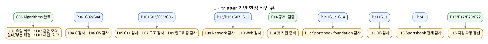

# L 작업 레인

## 정의

`L`은 `P` 프로젝트나 `G` 가이드처럼 처음부터 끝까지 이어지는 별도 학습 경로가 아니다.

> **`L`은 정해진 트리거가 충족됐을 때만 여는 한정 작업 큐다. 한 번에 한 작업만 실행하고, 정해진 산출물을 남긴 뒤 닫는다.**

[SVG](../assets/path/l-lane.svg) · [PNG](../assets/path/l-lane.png) · [Mermaid](../assets/path/l-lane.mmd) · [DOT](../assets/path/l-lane.dot) · [텍스트](../assets/path/l-lane.txt)



## 공통 규칙

```text
동시 활성: L 1개
기본 길이: 코딩 테스트 1회 또는 감사 1회
입력: 완료된 P/G 블록과 그 검증 근거
출력: 결과표·반례·P0/P1 목록·지원 자료 중 하나
종료: 정해진 산출물이 남고 후속 owner가 명확해짐
```

감사 도중 구현·대규모 문서 재작성·새 학습 범위가 필요해지면 현재 `L`을 확장하지 않는다. 해당 문제를 `P` 또는 `G`의 수정 작업으로 이동하고 `L`에는 발견 근거와 후속 owner만 남긴다. 이 규칙이 없으면 `L`이 보이지 않는 추가 장기 레인이 된다.

## L 작업 목록

| ID | 종류 | 트리거 | 한 회차 범위 | 산출물·완료 결과 | 반복 |
|---|---|---|---|---|---|
| L01 | 코딩 테스트 | G05 완료 | 핵심 유형 제한 시간 세트 1회 | 점수·시간·미해결 문제·접근/구현 오류 분리 | 반복 가능 |
| L02 | 코딩 테스트 | L01 1회 이상 | 목표 기업 형식 혼합 모의 1회 | 합격선 비교와 다음 약점 1~2개 | 반복 가능 |
| L03 | 회고 | L01/L02 부분 해결·실패 직후 | 실패 문제를 같은 입력으로 재현 | 반례·원인·수정·재실행 결과 | 필요 시 |
| L04 | 계열 감사 | P06 + G02 | C 계열 P01~P06과 P09의 소유권·I/O·검증 연결 | 모순·중복·누락 P0/P1 목록 | 필수 1회 |
| L05 | 계열 감사 | P11 + G03 | C++·시스템 P07·P08·P10·P11의 객체·container·BVH·event loop 연결 | 개념 owner와 재설명 조건 확정 | 필수 1회 |
| L06 | CS 감사 | P06 + G04 | OS ↔ small-shell·thread-dining | process/thread·동기화·deadlock 설명 대조 | 필수 1회 |
| L07 | CS 감사 | P10 + G06 | Architecture ↔ stl-container·ray-scene-tracer | data layout·cache·branch·parallelism 대조 | 필수 1회 |
| L08 | CS 감사 | P13 + G07 | Network ↔ irc·web-boundary·container-stack | TCP·DNS·proxy·TLS·부분 I/O 대조 | 필수 1회 |
| L09 | CS 감사 | P10 + G05 | Algorithms ↔ stack-sort·stl-container·ray tracer | 불변식·복잡도·oracle·반례 대조 | 필수 1회 |
| L10 | 계열 감사 | P15 + G08~G11 | 웹 P12~P15의 host/container/browser/DB/WebSocket 상태 연결 | 웹 계열 owner·failure·verification 지도 확정 | 필수 1회 |
| L11 | CS 감사 | P21 + G11 | DB ↔ pong-pong·wallet·betting·settlement | constraint·index·transaction·MVCC·복구 대조 | 필수 1회 |
| L12 | 계열 감사 | P19 + G12~G13 + G14 01~07 | sportsbook 기반 P16~P19의 schema·DB·Redis·Kafka 보장 연결 | 기반 서비스의 정본·전달 보장 확정 | 필수 1회 |
| L13 | 계열 감사 | P24 | sportsbook P16~P24 전체 data/control/runtime/evidence plane | 전체 P0/P1=0, 교차 링크·E2E 근거 확정 | 필수 1회 |
| L14 | 지원 준비 | P14 공개·검증 완료 | 첫 지원 전 이력서·대표 repo·5분 설명·모의 1회와 이미 완료된 확장 마일스톤 반영 | 1차 지원 가능한 최소 패키지 | 필수 1회 |
| L15 | 지원 갱신 | L14 완료 뒤 P15·P17·P20/P21·P22/P24 중 아직 반영하지 않은 마일스톤 충족 | 새 직군의 대표 repo·공고 등급·이력서 문구만 갱신 | 다음 지원 파동 준비 완료 | 마일스톤별 |

복습용 4트랙 PATH에서는 P15와 P17 이후 마일스톤의 실제 완료 순서가 고정되지 않는다. L14 전에 완료된 마일스톤은 L14 한 회차에서 함께 반영하고, L14 뒤에는 새로 충족된 마일스톤만 L15로 갱신한다. 같은 마일스톤을 번호 순서에 맞추기 위해 다시 열지 않는다.

## 코딩 테스트 범위와 종료 기준

L01의 핵심 유형은 다음으로 제한한다.

```text
배열·문자열 · hash map/set · stack/queue/deque · heap · 정렬
이분 탐색 · 투 포인터/sliding window · prefix sum
tree traversal · BFS/DFS · topological sort · Union-Find · Dijkstra
기본 greedy · 기본 dynamic programming
```

최종 기준은 다음과 같다.

```text
최근 혼합 모의 6회 중 4회 이상 목표 합격선
쉬운 문제 미완료가 반복되지 않음
중간 문제 1개 이상 안정 해결
검색·AI 없이 제한 시간 준수
접근 오류와 구현 오류를 분리해 회고 가능
```

기준을 통과한 뒤 문제 수를 무기한 늘리지 않는다. 지원 공고가 요구하는 형식이 달라졌을 때만 새 L01/L02 세션을 연다.

## 감사 결과 형식

```text
L ID:
입력 P/G:
확인한 계약:
P0:
P1:
P2:
후속 owner(P 또는 G):
재검증 명령:
완료일:
```

P0·P1 수정은 해당 owner에서 처리한다. P2는 backlog로 남기며 동일 감사를 처음부터 반복하지 않는다.
