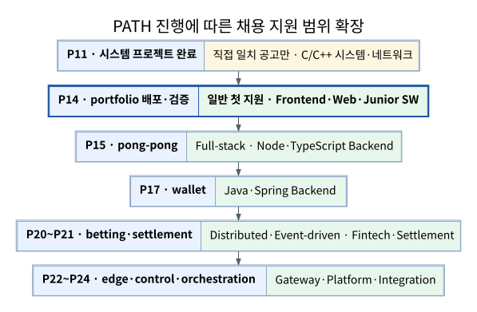

# 채용 지원 전략



[SVG](../assets/path/career-expansion.svg) · [PNG](../assets/path/career-expansion.png) · [Mermaid](../assets/path/career-expansion.mmd) · [DOT](../assets/path/career-expansion.dot) · [텍스트](../assets/path/career-expansion.txt)

## 판정 전제

```text
컴퓨터공학 학사
42 과정 수료
병역 만기 전역
입사 시점 제약 없음
해외근무 결격사유 없음
업무 영어는 약한 편
각 마일스톤까지 실제 완료·검증·공개한 프로젝트만 역량으로 계산
```

## 첫 지원 시점

> **P14 `portfolio-site`를 production 검증·공개 배포까지 끝낸 직후 일반 개발직 첫 지원을 시작한다.**

P15까지 기다리지 않는다. P14 완료 직후 [L14 지원 준비 감사](02-L-LANE.md)를 한 회차로 닫고 지원을 시작한다. 서류 검토·코딩 테스트·면접 대기 기간에는 P15 이후 프로젝트와 L01~L03을 병행한다.

P11 직후에는 공고가 C/C++·Linux·네트워크 프로젝트와 직접 맞는 경우에만 제한적으로 조기 지원한다.

## 지원 범위 확장

| 최소 마일스톤 | 새로 여는 지원 범위 | 대표 증거 |
|---|---|---|
| P11 | C/C++ 시스템·네트워크 서버·임베디드 인접 | `irc-relay-server`, `ray-scene-tracer`, `small-shell` |
| **P14** | **첫 일반 지원: React·Next.js 프런트엔드·웹 개발·주니어 SW** | `portfolio-site`, `web-boundary-inspector`, `container-stack` |
| P15 | 풀스택·Node.js·TypeScript 백엔드·실시간 서비스 | `pong-pong` |
| P17 | Java·Spring Boot·JPA·transaction 백엔드 | `sportsbook-wallet-service` |
| P20~P21 | Kafka·이벤트 기반·분산 멱등성·정산/결제 인접 | `sportsbook-betting-service`, `sportsbook-settlement-service` |
| P22~P24 | gateway·보안 경계·control plane·통합/플랫폼 인접 | `gateway`, `admin-api`, `orchestration` |

## 첫 지원 전 최소 장벽

```text
portfolio-site 공개 배포와 production build 검증
한 장짜리 이력서
지원 직군별 GitHub 대표 저장소 3~4개 고정
대표 프로젝트 2개를 각각 5분 내 설명
제한 시간 혼합 코딩 테스트 1회
자기소개·지원 이유·실패/복구 사례의 기본 답변
```

코딩 테스트 6회 기준과 전체 인터뷰 질문을 모두 끝낼 때까지 지원을 미루지 않는다.

## 지원 파동

| 파동 | 시점 | 실행 |
|---:|---|---|
| 1 | P14 직후 | 프런트엔드·웹·일반 주니어 공고에 선별 지원, 시장 반응 확인 |
| 2 | P15 직후 | 풀스택·Node/TypeScript 백엔드·실시간 서비스 추가 |
| 3 | P17 직후 | Java·Spring·transaction 중심 백엔드 추가 |
| 4 | P20~P21 | 이벤트 기반·분산·핀테크/결제 인접 공고 추가 |
| 5 | P22~P24 | API gateway·운영 control plane·통합·플랫폼 인접 추가 |

가장 선호하는 회사를 첫 파동에 모두 소진하지 않는다. P15/P17/P20/P22에서는 [L15 지원 파동 갱신](02-L-LANE.md)만 수행해 대표 저장소·이력서·공고 등급을 바꾼다. 각 파동의 서류·과제·면접 피드백은 다음 갱신에 반영한다.

## 공고 등급

| 등급 | 사용 기준 |
|---|---|
| 즉시 지원 | 해당 최소 PATH에서 핵심 필수 요건이 직접 맞고 명시적 경력 장벽이 낮음 |
| 조건부 지원 | 1~3년 요구 또는 일부 운영 경험 공백이 있으나 프로젝트로 대체 설명 가능 |
| 향후 지원 | 영어·AI·보안·커널·가속기 같은 전문 장벽이 핵심이므로 추가 준비 필요 |

공고별 판정과 링크는 [2026-08-03 정적 스냅숏](05-JOBS-2026-08-03.md)을 따른다.
