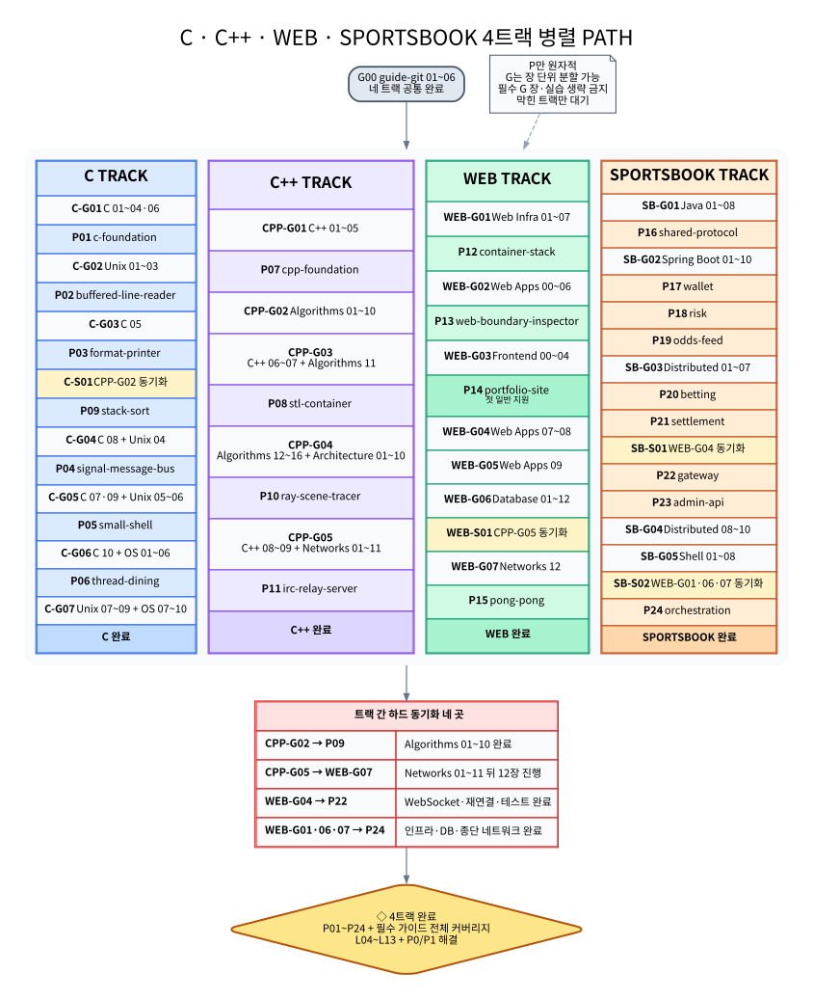
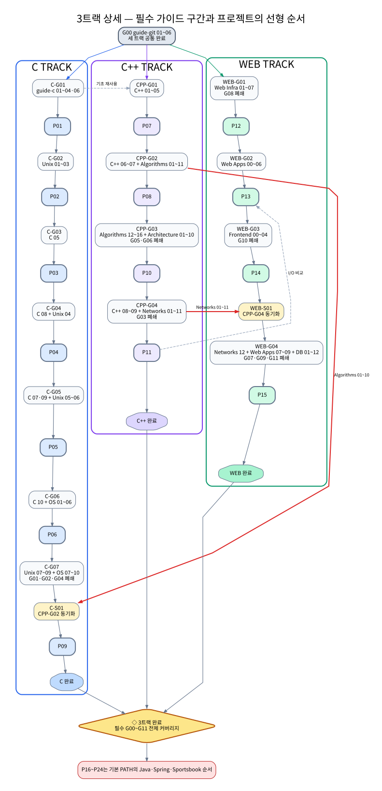

# C·C++·WEB·SPORTSBOOK 4트랙 병렬 PATH

이 문서는 42 과정과 기존 WEB·SPORTSBOOK 프로젝트를 한 번 수료한 뒤 프로젝트와 가이드를 다시 구현·복습할 때 사용하는 실행안이다. C, C++, WEB, SPORTSBOOK을 네 개의 병렬 트랙으로 진행하되, **각 트랙 안에서 G와 P를 선형으로 교차 배치한다.**

> **프로젝트만 원자적으로 완료한다. 가이드는 저장소 전체의 원자성을 해제해 필요한 장·실습을 시점별로 나누어 진행하지만, 필수 범위는 생략하지 않고 최종적으로 모두 이수한다. 트랙 사이에서는 실제 선행 관계만 하드 동기화한다.**

이 모드는 신규 학습 PATH가 아니다. 현재 회차에서 P15를 다시 끝내지 않았더라도 이전 수료 과정에서 확보한 HTTP·DB·인증·WebSocket 경험은 존재한다고 본다. 다만 기억만으로 직접 선행 범위를 삭제하지 않고, 프로젝트가 실제로 재사용하는 가이드 구간을 하드 동기화와 최종 감사로 다시 닫는다.

여기서 “체리피킹”은 Git의 `cherry-pick`이 아니다. 가이드의 commit을 옮기는 작업이 아니라, 가이드 내부의 장과 실습을 현재 프로젝트에 맞는 시점으로 재배치하는 운영 방식이다.

## 실행 원칙

| 대상 | 실행 규칙 |
|---|---|
| 네 트랙 | C, C++, WEB, SPORTSBOOK은 공통 G00 뒤 서로 기다리지 않고 시작할 수 있다. |
| 프로젝트 `P` | 같은 트랙에서 하나만 활성화한다. 시작한 프로젝트는 구현·검증·문서·P0/P1 처리까지 마친 뒤 다음 단계로 이동한다. |
| 가이드 `G` | 필요한 장·실습 구간만 현재 위치에 배치할 수 있다. 선택한 구간의 내부 선행 순서와 누적 실습 순서는 유지한다. |
| 필수 가이드 범위 | “이미 아는 내용”이라는 이유로 제거하지 않는다. 빠르게 복습할 수는 있지만 읽기·실습·검증 범위에서 삭제할 수 없다. |
| 트랙 간 의존성 | 직접 선행 관계만 하드 동기화한다. 개념 재사용이나 최종 비교는 다른 트랙 전체의 종료 장벽으로 만들지 않는다. |
| 프로젝트 ID | P 번호는 정본 식별자다. 병렬 모드의 실행 위치가 바뀌어도 번호와 저장소 정본은 바꾸지 않는다. |
| `L` 작업 | 코딩 테스트·연결 감사·지원 준비는 네 트랙 밖의 이벤트성 작업 큐다. 상세 규칙은 [L 작업 레인](02-L-LANE.md)을 따른다. |

같은 트랙에서는 다음 순서를 지킨다.

```text
필요한 G 구간 완료
→ P 시작
→ P를 원자적으로 완료
→ 다음 G 구간 또는 P
```

다른 트랙에서는 동시에 다음 상태가 가능하다.

```text
C TRACK          : G 또는 P 한 단계
C++ TRACK        : G 또는 P 한 단계
WEB TRACK        : G 또는 P 한 단계
SPORTSBOOK TRACK : G 또는 P 한 단계
```

하드 동기화에 도달한 트랙만 멈춘다. 기다리는 동안 같은 트랙의 뒤 P로 건너뛰지 않으며, 다른 세 트랙은 계속 진행할 수 있다.

## 전체 그래프

[SVG](../assets/path/parallel-path.svg) · [PNG](../assets/path/parallel-path.png) · [Mermaid](../assets/path/parallel-path.mmd) · [Graphviz DOT](../assets/path/parallel-path.dot) · [텍스트](../assets/path/parallel-path.txt) · [가이드 커버리지 SVG](../assets/path/parallel-guide-packets.svg)



## 공통 시작점

네 트랙을 열기 전에 `guide-git` 01~06을 완료한다.

```text
G00 guide-git 01~06
→ C TRACK ∥ C++ TRACK ∥ WEB TRACK ∥ SPORTSBOOK TRACK
```

완료 결과는 다음과 같다.

```text
작업 공간·branch·diff·commit
→ remote·PR·merge/rebase·conflict
→ reflog·revert·reset·외부 기여 복구
```

## C 트랙

```text
C-G01 → P01 → C-G02 → P02 → C-G03 → P03
→ [CPP-G02 동기화] → P09
→ C-G04 → P04 → C-G05 → P05
→ C-G06 → P06 → C-G07
```

| 순서 | 유형 | 범위 또는 프로젝트 | 역할·진입 조건 | 완료 결과 |
|---:|:---:|---|---|---|
| C-G01 | G | `guide-c` 01~04·06 | 프로그램 모델, 메모리·문자열·소유권, API·빌드·테스트, POSIX I/O를 먼저 복습 | P01의 바이트·할당·rollback·정적 라이브러리·부분 `write`를 설명할 수 있음 |
| P01 | P | `c-foundation` | C-G01 완료 뒤 시작 | 공개 API·소유권·실패 경로·배포 검증을 원자적으로 완료 |
| C-G02 | G | `guide-unix-systems` 01~03 | terminal·path·stream·FD와 부분 입출력을 관찰 | P02의 descriptor·remainder 상태를 운영체제 관점에서 추적 가능 |
| P02 | P | `buffered-line-reader` | P01 + C-G02 | `LINE/EOF/AGAIN/ERROR`, FD별 context, reset·수명 검증 완료 |
| C-G03 | G | `guide-c` 05 | 가변 인자와 형식 기반 API를 복습 | P03의 인자 타입·문법·길이·출력 계약을 설명 가능 |
| P03 | P | `format-printer` | P02 + C-G03 | parser·두 순회·부분 출력·`EINTR/EPIPE` 검증 완료 |
| C-S01 | 동기화 | CPP-G02의 `guide-algorithms` 01~10 | P09 시작 전에 문제 계약·분석·정렬·상환 범위를 완료 | C 트랙만 기다리고 다른 트랙은 계속 진행 |
| P09 | P | `stack-sort` | P03 + C-S01 | rank·radix·명령 비용·독립 checker/oracle 검증 완료 |
| C-G04 | G | `guide-c` 08 + `guide-unix-systems` 04 | signal, async-signal-safe 처리, process/thread 문맥을 복습 | handler와 main 문맥, signal 전달·상태 전이를 구분 가능 |
| P04 | P | `signal-message-bus` | P09 + C-G04 | self-pipe·session·ACK·출력 확정의 모호성 검증 완료 |
| C-G05 | G | `guide-c` 07·09 + `guide-unix-systems` 05~06 | process·FD·pipe·명령 실행기, memory·권한·환경을 복습 | shell의 parser/executor와 부모·자식·FD 수명을 설명 가능 |
| P05 | P | `small-shell` | P04 + C-G05 | lexer/parser·pipeline·builtin·redirection·종료 상태 검증 완료 |
| C-G06 | G | `guide-c` 10 + `guide-operating-systems` 01~06 | pthread·시간, kernel 경계·scheduler·atomicity·동기화·deadlock을 복습 | 공유 상태 불변식과 진행 보장을 구분 가능 |
| P06 | P | `thread-dining` | P05 + C-G06 | barrier·잠금 순서·terminal state·join/destroy 검증 완료 |
| C-G07 | G | `guide-unix-systems` 07~09 + `guide-operating-systems` 07~10 | socket·service·진단, VM·paging·filesystem·device I/O까지 남은 필수 범위를 완료 | C·Unix·OS 필수 가이드 범위 전체 이수, C 트랙 완료 |

### P09를 P03 뒤로 옮긴 이유

P09는 C 메모리·할당·rollback, descriptor 입력, parser와 부분 출력, 독립 oracle을 직접 재사용한다. P04의 signal IPC, P05의 process graph, P06의 pthread, C-G07의 VM·filesystem은 P09 시작 조건이 아니다. 따라서 P03 뒤가 가장 이른 안전 지점이며, `guide-algorithms` 01~10만 실제 하드 게이트로 남긴다.

P09를 앞당겨도 P 번호, 정본 위치와 기본 PATH는 바꾸지 않는다. C-G07은 특정 P의 구현 지식이 아니라 C·Unix·OS 필수 범위를 폐쇄하는 마지막 가이드다.

## C++ 트랙

```text
CPP-G01 → P07 → CPP-G02
→ CPP-G03 → P08 → CPP-G04 → P10
→ CPP-G05 → P11
```

| 순서 | 유형 | 범위 또는 프로젝트 | 역할·진입 조건 | 완료 결과 |
|---:|:---:|---|---|---|
| CPP-G01 | G | `guide-cpp` 01~05 | 타입·객체 수명·값 의미론·책임·다형성·오류를 복습 | P07의 복사·소유권·예외 계약을 설명 가능 |
| P07 | P | `cpp-foundation` | CPP-G01 완료 뒤 시작. 현재 회차의 C 트랙 전체 완료는 기다리지 않음 | 깊은 복사·factory·다형성·예외 안전성·template 입문 검증 완료 |
| CPP-G02 | G | `guide-algorithms` 01~10 | 문제 해결 루프·자료구조·분석·정렬·상환을 먼저 완료 | C 트랙 P09를 불필요한 template·RB-tree 범위보다 먼저 개방 |
| CPP-G03 | G | `guide-cpp` 06~07 + `guide-algorithms` 11 | template·iterator·STL과 RB-tree 불변식을 연결 | P08에 직접 필요한 generic·iterator·tree 범위 확보 |
| P08 | P | `stl-container` | P07 + CPP-G02~03 | allocator·raw storage·iterator·RB-tree·예외·복잡도·차등 검사 완료 |
| CPP-G04 | G | `guide-algorithms` 12~16 + `guide-computer-architecture` 01~10 | 고급 graph·문자열·환원·flow와 ISA·pipeline·cache·TLB·parallelism을 완료 | 알고리즘·컴퓨터구조 필수 범위 전체 이수, P10 비용·병렬 모델 확보 |
| P10 | P | `ray-scene-tracer` | P08 + CPP-G04 | linear/BVH 동치·shading·tile 병렬성·checksum 검증 완료 |
| CPP-G05 | G | `guide-cpp` 08~09 + `guide-computer-networks` 01~11 | POSIX socket·event loop·HTTP 책임과 link·IP·routing·TCP 상태·재전송·흐름/혼잡 제어를 완료 | C++ 필수 범위 전체 이수, network 12장을 제외한 기반 완료 |
| P11 | P | `irc-relay-server` | P10 + CPP-G05 | framing·partial I/O·backpressure·timeout·portable event loop·shutdown 검증 완료, C++ 트랙 완료 |

Algorithms 01~10은 P09의 직접 선행 범위이므로 P07 직후 독립 구간으로 먼저 닫는다. C++ 06~07과 Algorithms 11은 P08에만 직접 필요한 범위로 뒤에 둔다. 이 분할은 C 트랙이 template·RB-tree까지 기다리는 인공 장벽을 없애면서 가이드 내부의 01~11 순서를 보존한다.

P10과 P11은 코드 의존성이 약하지만 C++ 트랙 내부의 WIP를 하나로 유지하기 위해 위 순서를 고정한다.

## WEB 트랙

```text
WEB-G01 → P12 → WEB-G02 → P13
→ WEB-G03 → P14 → WEB-G04 → WEB-G05 → WEB-G06
→ [CPP-G05 동기화] → WEB-G07 → P15
```

| 순서 | 유형 | 범위 또는 프로젝트 | 역할·진입 조건 | 완료 결과 |
|---:|:---:|---|---|---|
| WEB-G01 | G | `guide-web-infrastructure` 01~07 | request·container·Compose·Nginx/TLS·DB lifecycle·bootstrap·운영/복구를 모두 완료 | P12와 SPORTSBOOK P24의 인프라 선행 범위 확보 |
| P12 | P | `container-stack` | WEB-G01 완료 뒤 시작 | TLS·bootstrap·readiness·영속성·backup/restore·rotation·diagnostics 검증 완료 |
| WEB-G02 | G | `guide-web-applications` 00~06 | JS/TS·browser·React/Next·HTTP API·PostgreSQL·인증/보안을 순서대로 완료 | P13과 이후 WebSocket 구간의 runtime·security 기반 확보 |
| P13 | P | `web-boundary-inspector` | P12 + WEB-G02 | request 변환·DOM·task/microtask·Fetch·History·storage·cookie·CORS/CSP 검증 완료 |
| WEB-G03 | G | `guide-frontend-react-nextjs` 00~04 | browser/React 기초, onboarding, UI·state/data/effect, 접근성·성능·배포를 모두 완료 | P14 프런트엔드 가이드 전체 이수 |
| P14 | P | `portfolio-site` | P13 + WEB-G03 | production build·공개 배포·runtime validation·접근성·성능 근거 확보; 첫 일반 지원 gate 개방 |
| WEB-G04 | G | `guide-web-applications` 07~08 | WebSocket·재연결과 HTTP·DB·WebSocket·browser 테스트를 완료 | WEB-G02의 인증/보안 위에서 SPORTSBOOK P22의 직접 선행 범위 확보 |
| WEB-G05 | G | `guide-web-applications` 09 | 앞 장의 기능을 하나의 종합 서비스 요구사항과 완료 조건으로 묶음 | web applications 필수 범위 전체 이수; P15 종합 구현 기준 확보 |
| WEB-G06 | G | `guide-database-systems` 01~12 | 관계·저장·index·transaction·MVCC·WAL·query cost를 완료 | database 필수 범위 전체 이수; P15와 SPORTSBOOK DB 감사·P24 기반 확보 |
| WEB-S01 | 동기화 | CPP-G05의 `guide-computer-networks` 01~11 | network 12장을 진행하기 전에 앞 장의 전송·경로 범위를 완료 | 가이드 내부 순서를 트랙 간에도 보존 |
| WEB-G07 | G | `guide-computer-networks` 12 | DNS·HTTP·TLS·QUIC를 앞의 link·IP·TCP 모델 위에 연결 | network 필수 범위 전체 이수; P15와 SPORTSBOOK P24 기반 확보 |
| P15 | P | `pong-pong` | P12~P14 + WEB-G04~07 | session·API·DB·WebSocket·room·scheduler·reconnect·transaction·배포 검증 완료, WEB 트랙 완료 |

기존 WEB-G04의 세 가이드 묶음은 직접 선행 관계가 달라 WEB-G04~07로 분리한다. WebSocket·테스트 07~08만 먼저 닫아 SPORTSBOOK P22를 개방하고, 종합 요구사항 09는 P15 쪽에 남긴다. Database 전체와 network 12장을 P22가 기다리지 않게 하며, network 12장만 CPP-G05를 기다리게 한다.

## SPORTSBOOK 트랙

```text
SB-G01 → P16 → SB-G02 → P17 → P18 → P19
→ SB-G03 → P20 → P21
→ [WEB-G04 동기화] → P22 → P23
→ SB-G04 → SB-G05
→ [WEB-G01·WEB-G06·WEB-G07 동기화] → P24
```

| 순서 | 유형 | 범위 또는 프로젝트 | 역할·진입 조건 | 완료 결과 |
|---:|:---:|---|---|---|
| SB-G01 | G | `guide-java` 01~08; 00은 필요 시 | Java 17·JVM·값 객체·컬렉션·숫자·오류·동시성·Maven·테스트를 완료 | P16의 Java library와 계약 검증 기반 확보 |
| P16 | P | `sportsbook-shared-protocol` | SB-G01 완료 뒤 시작. 현재 회차의 P15는 기다리지 않음 | Maven artifact·값 객체·JSON·Avro·schema 호환성 검증 완료 |
| SB-G02 | G | `guide-backend-spring-boot` 01~10; 00은 필요 시 | startup·HTTP·JPA·PostgreSQL·Redis·Kafka·Outbox·HTTP client·Testcontainers·관측을 완료 | P17~P19의 공통 Spring 실행·검증 기반 확보 |
| P17 | P | `sportsbook-wallet-service` | P16 + SB-G02 | 잠금·복식부기 원장·멱등성·outbox·대사·내부 API 검증 완료 |
| P18 | P | `sportsbook-risk-service` | P17 | Redis Lua 기준 상태·reservation lifecycle·replay·AOF 한계 검증 완료 |
| P19 | P | `sportsbook-odds-feed-service` | P18 | provider·scheduler·Redis projection·Kafka·Stream의 서로 다른 보장 검증 완료 |
| SB-G03 | G | `guide-distributed-services` 01~07 | 서비스 경계·동기/비동기 판정·멱등성·outbox/saga·event order·late event·retry/DLQ를 완료 | P20~P23의 부분 실패·복구·전달 모델 확보 |
| P20 | P | `sportsbook-betting-service` | P16~P19 + SB-G03 | risk 예약·wallet 차감·PENDING·보상·outbox·recovery 검증 완료 |
| P21 | P | `sportsbook-settlement-service` | P20 + P17 | read model·wallet plan·lease/fencing·outbox·DLT·재실행 검증 완료 |
| SB-S01 | 동기화 | WEB-G04의 `guide-web-applications` 07~08 | P22 전에 WEB-G02의 auth 기반 위에서 WebSocket·재연결·테스트 범위를 완료 | 사용자 data plane의 REST/STOMP 경계를 현재 회차 지식으로 재확인 |
| P22 | P | `sportsbook-gateway` | P17 + P19~P21 + SB-S01 | JWT·trusted header·route·rate limit·Kafka→STOMP·readiness 검증 완료 |
| P23 | P | `sportsbook-admin-api` | P22 + 대상 서비스 운영 API | RBAC·IP allowlist·delegation·audit·비원자 위임 경계 검증 완료 |
| SB-G04 | G | `guide-distributed-services` 08~10 | 다중 저장소 build/release, E2E·chaos와 성능 근거를 완료 | P24의 release·evidence plane 직접 선행 범위 확보, distributed services 전체 이수 |
| SB-G05 | G | `guide-shell-scripting` 01~08 | P24가 다중 저장소 build·verify·release script를 직접 수정하므로 조건부 필수 조건이 성립 | 인자·실패 전파·임시 자원·signal 정리·이식성·repository auditor 검증 완료 |
| SB-S02 | 동기화 | WEB-G01·WEB-G06·WEB-G07 | P24 전에 Compose/복구, DB 내부 모델, DNS·HTTP·TLS 종단 경로를 모두 완료 | runtime·data·network evidence를 통합할 선행 범위 확보 |
| P24 | P | `sportsbook-orchestration` | P16~P23 + SB-G04~05 + SB-S02 | workspace verify·JAR generation·Compose·cold E2E·chaos·observability·release evidence 검증 완료, SPORTSBOOK 트랙 완료 |

Distributed services 08~10은 P20의 접수·정산 상태 머신보다 P24의 다중 저장소 release와 E2E evidence에 직접 대응하므로 뒤로 이동한다. 01~07을 P20 전에 완료해 실패·복구 모델은 유지하면서 release·성능 범위가 P20을 불필요하게 막지 않게 한다.

P17~P19는 서로 직접 artifact를 소비하는 강한 코드 체인이라서가 아니라, PostgreSQL transaction/outbox → Redis Lua 기준 상태 → projection/Kafka/Stream 전달 보장을 비교하는 학습 순서를 유지하기 위해 선형으로 둔다. P20부터는 앞 서비스들을 한 업무 흐름으로 결합하므로 실제 프로젝트 의존성이 강해진다.

## 트랙 간 하드 동기화

### 방향과 완료 기준

이 문서의 `A → B`는 양쪽이 서로를 기다리는 양방향 rendezvous가 아니다. **B를 시작하려면 A 블록이 완료되어야 한다는 단방향 선행 게이트**다. A는 B의 진행이나 완료를 기다리지 않고 자기 트랙의 다음 단계로 이동할 수 있다.

```text
A → B

B 시작 조건에 A 완료가 추가됨
A 완료 조건에는 B가 포함되지 않음
```

A 완료는 B의 외부 필요조건이지만 그것만으로 충분하지는 않다. B가 속한 트랙의 내부 선행도 함께 완료되어야 한다. 또한 A에 도착했거나 A를 진행 중인 상태는 충족으로 보지 않는다. 지정 장·실습·검증과 P0/P1 확인까지 끝나 **A 블록이 완료**되어야 동기화 노드를 통과한다.

동기화 노드인 C-S01·WEB-S01·SB-S01·SB-S02는 별도의 학습 블록이 아니라 완료 여부를 확인하는 checkpoint다. 생산 트랙이 먼저 선행 범위를 완료했다면 기다리는 트랙은 checkpoint를 즉시 통과한다. 기다리는 트랙이 먼저 도착했다면 그 트랙만 멈추고 나머지 트랙은 계속 진행한다.

예를 들어 P09의 시작 조건은 다음과 같다.

```text
P03 완료
+ CPP-G02 완료
→ C-S01 통과
→ P09 시작
```

CPP-G02가 완료됐다는 사실은 C++ 트랙 내부 순서상 CPP-G01과 P07도 이미 완료됐음을 포함한다. 그러나 P09의 직접 외부 의존성은 그 전체 이력이 아니라 CPP-G02에 배치된 `guide-algorithms` 01~10이다. CPP-G02는 P09를 기다리지 않으므로 완료 뒤 CPP-G03으로 계속 진행한다.

WEB 트랙은 공통 G00과 자기 트랙 내부 순서만 지키면 WEB-G01부터 WEB-G06까지 외부 선행 없이 진행할 수 있다. 첫 외부 대기는 WEB-G07 직전의 WEB-S01이며, 이때만 CPP-G05 완료 여부를 확인한다. `WEB-G04 → P22`도 WEB 트랙을 막지 않고 SPORTSBOOK 트랙의 P22만 기다리게 한다.

그래프에서는 하드 동기화 전체를 하나의 공통색으로 칠하지 않는다. 각 관계에 `S1`~`S4`를 부여하고, **같은 관계의 제공 노드·checkpoint·소비 노드만 같은 동기화 강조색**을 사용한다. 서로 다른 관계는 서로 다른 색을 사용하므로 같은 색을 따라가면 어느 선행 범위가 어느 gate를 여는지 확인할 수 있다. 트랙의 기본 테두리 색은 소유 트랙을, 동기화 강조색은 관계를 뜻한다.

| 동기화 색상 ID | 같은 강조색을 사용하는 노드 | 방향 |
|---|---|---|
| S1 | `CPP-G02` · `C-S01` · `P09` | `CPP-G02 → P09` |
| S2 | `CPP-G05` · `WEB-S01` · `WEB-G07` | `CPP-G05 → WEB-G07` |
| S3 | `WEB-G04` · `SB-S01` · `P22` | `WEB-G04 → P22` |
| S4 | `WEB-G01` · `WEB-G06` · `WEB-G07` · `SB-S02` · `P24` | `WEB-G01·WEB-G06·WEB-G07 → P24` |

`WEB-G07`은 S2의 소비 노드이면서 S4의 제공 노드이므로 두 강조색을 함께 표시한다. DOT/SVG/PNG에서는 분할 채움, Mermaid에서는 S2 채움과 S4 테두리, 텍스트에서는 `S2·S4` 표기를 사용한다. 이는 양방향 의존성을 뜻하지 않고, 서로 다른 두 단방향 gate에 같은 완료 블록이 참여한다는 뜻이다.

| 연결 | 직접 선행 관계 | 기다리는 트랙 | 처리 방식 |
|---|---|---|---|
| `CPP-G02 → P09` | Algorithms 01~10이 rank·radix·정확성·비용 설명의 선행 범위 | C | P03 뒤 C-S01에서 대기 |
| `CPP-G05 → WEB-G07` | Networks 01~11 뒤에 12장을 진행해야 가이드 내부 순서 보존 | WEB | WEB-G06을 먼저 끝낸 뒤 WEB-S01에서 대기 |
| `WEB-G04 → P22` | WEB-G02의 auth 기반 위에서 WebSocket·재연결·테스트가 gateway REST/STOMP 경계의 직접 선행 범위 | SPORTSBOOK | P21 뒤 SB-S01에서 대기 |
| `WEB-G01·WEB-G06·WEB-G07 → P24` | Compose/복구·DB·종단 네트워크 모델이 통합 evidence의 직접 선행 범위 | SPORTSBOOK | P23와 SB-G04~05 뒤 SB-S02에서 대기 |

따라서 강한 트랙 간 동기화는 네 곳이다.

```text
CPP-G02 → P09
CPP-G05 → WEB-G07
WEB-G04 → P22
WEB-G01·WEB-G06·WEB-G07 → P24
```

다음 연결은 하드 동기화가 아니다.

| 연결 | 처리 |
|---|---|
| C-G01 → CPP-G01 | C 메모리·소유권은 재사용하되 현재 회차 C 트랙 전체를 기다리지 않는다. 부족한 항목은 CPP-G01에서 다시 확인한다. |
| P12·P13·P15 → SPORTSBOOK | 과거 수료 경험과 문서 인용은 재사용하지만 현재 회차 프로젝트 완료를 gate로 두지 않는다. 직접 필요한 WEB 가이드 구간만 P22·P24에 동기화한다. |
| P05·P06·P11·P12·P13 | process/thread·FD/socket·partial I/O·signal·shutdown을 최종 감사에서 대조한다. |
| P08·P09·P10 | invariant·complexity·tree/BVH·oracle을 최종 감사에서 대조한다. |
| P15·P17·P20·P21 | DB constraint·transaction·MVCC·recovery를 L11에서 대조한다. |

## 가이드 체리피킹과 필수 커버리지

[SVG](../assets/path/parallel-guide-packets.svg) · [PNG](../assets/path/parallel-guide-packets.png) · [Mermaid](../assets/path/parallel-guide-packets.mmd) · [Graphviz DOT](../assets/path/parallel-guide-packets.dot) · [텍스트](../assets/path/parallel-guide-packets.txt)



가이드의 저장소 전체 원자성만 해제한다. 다음 규칙은 해제하지 않는다.

1. 필수 가이드의 모든 지정 장은 PATH 어딘가에 정확히 배치한다.
2. 선택한 구간 안에서 앞 장이 뒤 장의 상태 모델을 정의하면 그 순서를 유지한다.
3. 누적 실습은 중간 stage부터 적용하지 않는다.
4. 한 가이드의 장을 여러 트랙으로 나눈 경우 앞 구간 완료를 뒤 구간의 동기화 조건으로 둔다.
5. 프로젝트 경험이나 기억 점검만으로 필수 장의 이수를 대체하지 않는다.
6. “복습”은 읽기와 실습 속도를 높이는 근거일 뿐, 필수 범위를 삭제하는 근거가 아니다.
7. P24의 다중 저장소 shell 자동화는 `guide-shell-scripting` 조건을 실제로 충족하므로 선택 범위로 되돌리지 않는다.

## 필수 가이드 커버리지 표

| 필수 가이드 | 배치 위치 | 최종 커버리지 |
|---|---|---|
| `guide-git` | 공통 G00 | 01~06 |
| `guide-c` | C-G01·03·04·05·06 | 01~10 전체 |
| `guide-unix-systems` | C-G02·04·05·07 | 01~09 전체 |
| `guide-operating-systems` | C-G06·07 | 01~10 전체 |
| `guide-cpp` | CPP-G01·03·05 | 01~09 전체 |
| `guide-algorithms` | CPP-G02·03·04 | 01~16 전체 |
| `guide-computer-architecture` | CPP-G04 | 01~10 전체 |
| `guide-computer-networks` | CPP-G05 + WEB-G07 | 01~12 전체 |
| `guide-web-infrastructure` | WEB-G01 | 01~07 전체 |
| `guide-web-applications` | WEB-G02·04·05 | 00~09 전체 |
| `guide-frontend-react-nextjs` | WEB-G03 | 00~04 전체 |
| `guide-database-systems` | WEB-G06 | 01~12 전체 |
| `guide-java` | SB-G01 | 01~08 전체 |
| `guide-backend-spring-boot` | SB-G02 | 01~10 전체 |
| `guide-distributed-services` | SB-G03·04 | 01~10 전체 |
| `guide-shell-scripting` | SB-G05 | 01~08 전체 |

`guide-java`와 `guide-backend-spring-boot`의 00장은 선택 선행 문서다. 해당 실행 모델이 낯설면 각 가이드의 01장 전에 완료하고 기록한다.

### 조건부 가이드

- `guide-python`은 Python 기반 CS 상태 모델·CLI·테스트를 독립적으로 수정하기 어렵다면 조건부 필수가 된다. 조건이 성립하면 첫 Python 실습 전에 01~08을 적절한 구간으로 나누어 모두 완료한다.
- `guide-shell-scripting`은 일반 PATH에서는 선택 가이드지만, 이 4트랙 실행안의 P24가 다중 저장소 자동화·검사·release script 수정을 포함하므로 조건이 이미 성립한다.

## 현재 위치 기록

```text
C TRACK          : ____________________
C++ TRACK        : ____________________
WEB TRACK        : ____________________
SPORTSBOOK TRACK : ____________________
이번 L           : ____________________
다음 동기화      : ____________________
```

G 단계는 가이드와 장 번호까지 기록한다.

```text
예: WEB-G06 / guide-database-systems 07~08 진행 중
예: SB-G03 / guide-distributed-services 04~06 진행 중
```

P 단계는 완료 전까지 같은 트랙의 다음 G 또는 P로 이동하지 않는다.

## 채용과 L 작업

- P14가 production 배포까지 완료되면 다른 세 트랙의 종료를 기다리지 않고 첫 일반 지원을 시작한다.
- P15와 P17은 병렬 마일스톤이다. 어느 쪽이 먼저 끝났는지에 따라 지원 증거가 활성화되며 번호 순서를 기다리지 않는다.
- P14 전에 P17·P20/P21·P22/P24가 완료됐다면 L14에서 해당 직군을 함께 반영한다.
- P14 뒤 새 마일스톤이 완료되면 L15를 한 회차만 열어 지원 자료를 갱신한다.
- C/C++ 시스템 직무는 해당 트랙 프로젝트와 연결 감사가 완료된 범위만 제출 근거로 사용한다.
- 코딩 테스트·연결 감사·지원 준비는 [L 작업 레인](02-L-LANE.md)에서 한 회차씩 열고 닫는다.

## 트랙 완료 조건

각 트랙은 다음 조건에서 독립적으로 완료된다.

```text
C TRACK:
P01~P06 + P09 완료
C-G01~07 완료

C++ TRACK:
P07 + P08 + P10 + P11 완료
CPP-G01~05 완료

WEB TRACK:
P12~P15 완료
WEB-G01~07 완료

SPORTSBOOK TRACK:
P16~P24 완료
SB-G01~05 완료
SB-S01~02 통과
```

전체 복습 PATH는 다음을 모두 충족해야 닫힌다.

```text
네 트랙 완료
필수 가이드 커버리지 표 전체 이수
guide-python 조건 판정과 결과 기록
L04~L13 필수 감사 완료
P0·P1 해결
그래프·문서·정본 링크와 완료 근거 재검증
```
