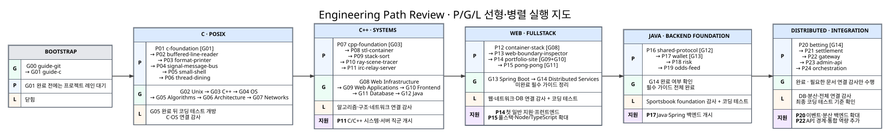

# 선형·병렬 Engineering PATH

> **각 병렬 레인 내부에서는 블록을 원자적으로 완료한다. 서로 의존하지 않는 다른 레인의 블록은 동시에 진행할 수 있다.**



원본: [Mermaid](../assets/path/path-overview.mmd) · [Graphviz DOT](../assets/path/path-overview.dot) · [SVG](../assets/path/path-overview.svg) · [PNG](../assets/path/path-overview.png)

## 세 레인

| 레인 | 활성 상한 | 다음 블록으로 이동하는 조건 |
|---|---:|---|
| `P` 프로젝트 | 1 | 현재 프로젝트의 코드·문서·검증·공개 결과가 닫힘 |
| `G` 가이드 | 1 | 본문·직접 구현·정상/실패 검증·비보장 설명이 닫힘 |
| `L` 코딩 테스트·감사 | 1 session | 정해진 시간과 범위를 가진 한 세션이 종료됨 |

한 사람이 동시에 유지할 최대 작업량은 `무거운 P 1 + 무거운 G 1 + 가벼운 L 1`이다.

## 프로젝트 spine

```text
P01→P02→P03→P04→P05→P06
→ P07→P08→P09→P10→P11
→ P12→P13→P14→P15
→ P16→P17→P18→P19
→ P20→P21→P22→P23→P24
```

프로젝트별 역할·진입·완료 결과는 [프로젝트 PATH](PROJECTS.md) 한 표만 정본으로 사용한다.

## 가이드 spine

```text
G00→G01→G02→G03→G04→G05→G06→G07
→ G08→G09→G10→G11→G12→G13→G14
```

`guide-python`과 `guide-shell-scripting`은 조건부 branch다. 가이드별 정본 표는 [가이드 PATH](GUIDES.md)를 사용한다.

## 프로젝트 시작을 막는 하드 게이트

| 가이드 완료 | 열리는 프로젝트·레인 |
|---|---|
| `G01 guide-c` | `P01 c-foundation` |
| `G03 guide-cpp` | `P07 cpp-foundation` |
| `G05 guide-algorithms` | `L` 코딩 테스트 |
| `G08 guide-web-infrastructure` | `P12 container-stack` |
| `G09 + G10` | `P14 portfolio-site` |
| `G11 guide-database-systems` | `P15 pong-pong` |
| `G12 guide-java` | `P16 sportsbook-shared-protocol` |
| `G13 guide-backend-spring-boot` | `P17 sportsbook-wallet-service` |
| `G14 guide-distributed-services` | `P20 sportsbook-betting-service` |

그 밖의 CS 가이드는 프로젝트를 선행 차단하지 않고, 해당 계열 완료 뒤 제한 감사에서 합친다.

## 채용 지원이 붙는 지점

| 마일스톤 | 지원 범위 |
|---|---|
| `P11` | 직접 맞는 C·C++ 시스템·네트워크·서버 직군 |
| `P14` | 첫 일반 지원 시작, React·Next.js 프런트엔드·웹 개발 |
| `P15` | 풀스택, Node.js·TypeScript 백엔드, 실시간 웹 서비스 |
| `P17` | Java·Spring Boot·JPA·트랜잭션 백엔드 |
| `P20` | 이벤트 기반·분산 멱등성·복구 workflow 백엔드 |
| `P22` | API edge·인증·routing·실시간 전달을 요구하는 일반 소프트웨어 직군 |

첫 일반 지원은 `P14` 직후 시작하며, 이후 프로젝트와 코딩 테스트·인터뷰 준비를 채용 절차의 대기 기간과 병렬 진행한다. 자세한 운영은 [채용 지원 전략](APPLICATION_STRATEGY.md)을 따른다.

## 현재 위치 기록

```text
현재 P: ________ | 현재 G: ________ | 이번 L: ________ | 다음 하드 게이트: ________
```
